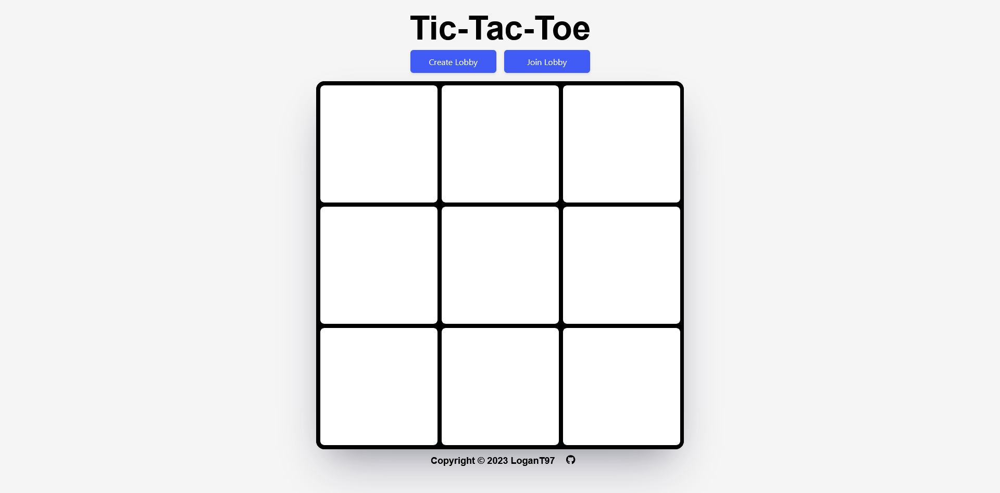

# Tic-Tac-Toe Multiplayer Game

This is a simple multiplayer tic-tac-toe game built using Firebase and JavaScript. Multiple players can join a lobby, take turns making their moves, and the game will determine the winner or declare a tie when appropriate.

## How to Play the Game

1. Access the game using a web browser on your device or mobile phone.

2. Choose one player to create a new lobby. Enter a name for the player and click the "Create Lobby" button.

3. Share the lobby code generated with the other player.

4. The other player can join the lobby by clicking the "Join Lobby" button and entering the lobby code along with their name.

5. Once the second player has joined, the game will start automatically and display "Game started!". Players take turns making moves by clicking on the empty cells of the game board.

6. The game ends when a player wins by achieving three in a row horizontally, vertically, or diagonally, or when all the cells are filled and no winner is found.

## Technologies Used

- Firebase Realtime Database: Stores and syncs game data in real-time.

- HTML/CSS: Provides the user interface and styling for the game.

- JavaScript: Implements the game logic and Firebase integration.

## Live Link

You can try the game live at [Tic-Tac-Toe Multiplayer]((https://logant97.github.io/Tic-Tac-Toe/)).

## Screenshots

